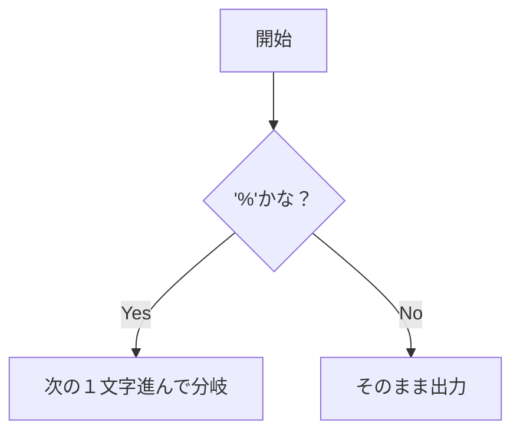

# mandatory の conversions

**int ft_printf(const char *, ...);**  

return 出力された文字数＋１文字分のint  
1st arg %まで普通に出力して  
2nd arg  

=== %c ===  
original -> y  
14 

=== %s ===  
original -> cat is cute.  
25  

=== %p ===  
original -> 0x613f221da011  
27  

=== %d ===  
original -> -42  
16  

=== %i ===  
original -> -2525  
18  

=== %u ===  
original -> 55  
15  

=== %x ===  
original -> 2a  
15  

=== %X ===  
original -> 2A  
15  

=== %% ===  
original -> %  
14  

=== (NULL) ===  
original -> (null)  
19  

=== (nil) ===  
original -> (nil)  
18  

~~~

#include <stdio.h>
#include <limits.h>

int main(){
	char c = 'y';
	char *s = "cat is cute.";
	char *p = "dog is also cute.";
	int d = -42;
	int i = -2525;
	unsigned int u = 55;
	int l_x = 42;
	int u_x = 42;
	char * null = NULL;
	int ans = 0;

	printf("=== %%c ===\n");
	ans = printf("original -> %c\n", c);
	printf("%d\n", ans);

	printf("=== %%s ===\n");
	ans = printf("original -> %s\n", s);
	printf("%d\n", ans);

	printf("=== %%p ===\n");
	ans = printf("original -> %p\n", p);
	printf("%d\n", ans);

	printf("=== %%d ===\n");
	ans = printf("original -> %d\n", d);
	printf("%d\n", ans);

	printf("=== %%i ===\n");
	ans = printf("original -> %i\n", i);
	printf("%d\n", ans);

	printf("=== %%u ===\n");
	ans = printf("original -> %u\n", u);
	printf("%d\n", ans);

	printf("=== %%x ===\n");
	ans = printf("original -> %x\n", l_x);
	printf("%d\n", ans);

	printf("=== %%X ===\n");
	ans = printf("original -> %X\n", u_x);
	printf("%d\n", ans);

	printf("=== %% ===\n");
	ans = printf("original -> %%\n");
	printf("%d\n", ans);

	printf("=== (NULL) ===\n");
	ans = printf("original -> %s\n", null);
	printf("%d\n", ans);

	printf("=== (nil) ===\n");
	ans = printf("original -> %p\n", null);
	printf("%d\n", ans);

	return(0);
}
~~~
